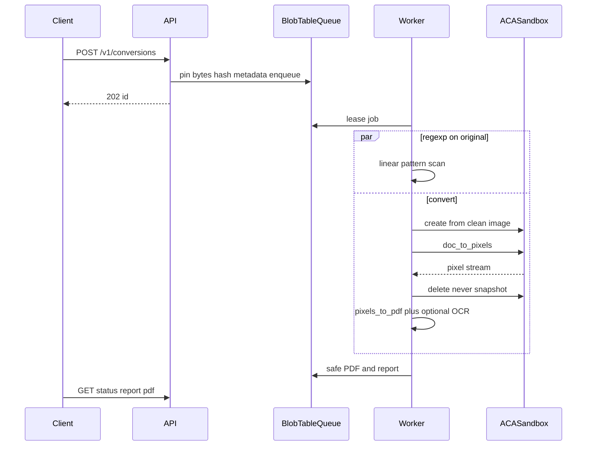
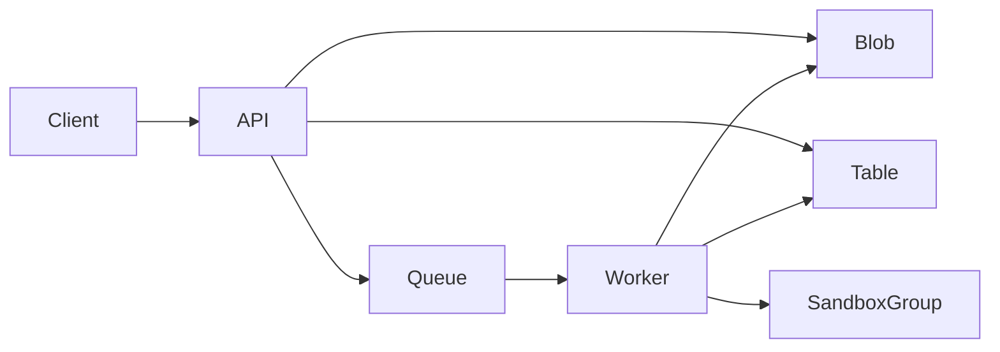

# BluePaper architecture

This document is the source of truth for BluePaper. It supersedes the product scope in [README.md](README.md) (deep PDF analysis: parser IR, JavaScript AST, visual phishing). That exploration remains in [docs/research-and-architecture.md](docs/research-and-architecture.md) and is not part of this architecture.

BluePaper is a network-service fork of [Dangerzone](https://github.com/freedomofpress/dangerzone): callers upload an untrusted document and receive a PDF rebuilt from pixels, plus a regexp report of raw byte indicators in the original. A hit is not proof that an active construct was present.

---

## 1. Product and security objective

Safety comes from **destruction**, not detection. The original file is opened only inside an isolated sandbox (LibreOffice, Poppler, and the rest of Dangerzone’s converters). The trusted plane never parses the original. Pixel reconstruction cannot carry JavaScript, macros, embedded executables, malformed-parser exploits, or most metadata.

The regexp pass is **informational**. It reports raw byte indicators such as `/JavaScript`, `/Launch`, or `vbaProject.bin`. A hit does not mean that construct was present; the same bytes can occur in metadata or other inert data. **Zero hits is not “clean.”** Compression and other encodings can hide those strings. Conversion still runs; the report must say that absence of patterns is not a malware verdict.

### Threat model

**Assets.** Uploaded samples, sanitized PDFs, analysis reports, API keys, and the hosts that run the API and worker.

**Adversaries.** Authors of malicious or malformed documents; callers who submit hostile files to probe the converter; anyone who can reach the HTTP port without a valid key.

**Trust boundaries.**

- Clients are authenticated but not trusted. Every upload is hostile.
- The API process and `pixels_to_pdf` never load native document parsers.
- A sandbox compromise must not yield network access, secrets, or other jobs’ blobs.
- The adversary can also try ReDoS and resource exhaustion against the API and the regexp scanner.

**In scope.** Rasterizing supported document types to a safe PDF; reporting raw byte indicators from the original; running that work as a single-tenant API in the operator’s Azure subscription.

**Out of scope.** Dual-parser PDF forensics, non-executing JavaScript AST analysis, visual phishing (OCR/QR lures), Windows reader detonation, public multi-tenant SaaS, live URL fetching, and a single binary “malicious” label as the primary output.

### Fork and license

Keep `dangerzone.conversion.doc_to_pixels` and `dangerzone.conversion.pixels_to_pdf` close to upstream. Replace the desktop GUI and the Podman/gVisor isolation provider with:

- an Azure Container Apps Sandbox isolation provider
- an HTTP API
- a versioned regexp pattern catalog

Do not reimplement rasterization.

Dangerzone is AGPLv3. Offering BluePaper as a network service triggers the AGPL network-use terms: operators who run the API must provide corresponding source to users of that service.

---

## 2. End-to-end lifecycle

Always convert. Run the regexp scan **in parallel** on the pinned original bytes (no sandbox). After both finish, persist artifacts. If conversion fails, still return regexp hits when the scan completed — useful when the file was too hostile to render.



1. The client uploads a document. The API authenticates, enforces size budgets, hashes the bytes (SHA-256), writes an immutable blob, creates a table row, enqueues the conversion id, and returns immediately.
2. A worker leases the queue message. It starts the regexp scan on the original bytes and, in parallel, creates a fresh ACA Sandbox from a **clean** disk image.
3. The sandbox runs `doc_to_pixels`. The worker consumes the pixel stream, then **deletes** the sandbox (never snapshot after a document has been seen).
4. The trusted worker runs `pixels_to_pdf`, optional OCR, and compression.
5. The worker writes the sanitized PDF and JSON report. The client polls status, then fetches the report and PDF.

---

## 3. Input acquisition, pinning, and isolation

### Authentication and tenancy

Integrators send `Authorization: Bearer <api-key>` on conversion routes. The console at `/` never sends that key. `POST /v1/conversions` accepts a completed Cloudflare Turnstile token instead (`cf-turnstile-response`). A conversion queued that way is readable and deletable by anyone who has its id. Conversions queued with an API key still require the key; a valid key does not require Turnstile. `GET /v1/source`, `/`, `/ui`, `/healthz`, `/openapi.json`, `/docs`, and `/redoc` do not require a key. v1 is a **single-tenant** REST API in the operator’s Azure subscription. Samples stay in that tenant. This is not a public multi-tenant SaaS.

### Pinning

- Hash the raw bytes (SHA-256 hex). Blobs are hash-addressed and immutable.
- Enforce operator-configured size, page, pixel-dimension, wall-clock, and output-size budgets.
- Structured logs carry request/conversion ids and stage timings. **No sample bytes in logs.**

### Supported file types

Same set as Dangerzone:

- PDF (`.pdf`)
- Microsoft Word (`.docx`, `.doc`)
- Microsoft Excel (`.xlsx`, `.xls`)
- Microsoft PowerPoint (`.pptx`, `.ppt`)
- ODF Text / Spreadsheet / Presentation / Graphics (`.odt`, `.ods`, `.odp`, `.odg`)
- Hancom HWP / HWPX (`.hwp`, `.hwpx`)
- EPUB (`.epub`)
- JPEG, GIF, PNG, SVG, and other common images (`.bmp`, `.pnm`, `.pbm`, `.ppm`, `.tif`, `.tiff`)

Unsupported types return `415` before a sandbox is created.

### Isolation

**One fresh ACA Sandbox per conversion.**

- Egress **deny-all**.
- No managed identity on the sandbox, or none that can read other jobs’ storage.
- The worker copies the document in and the pixel stream out. The sandbox never talks to Blob Storage directly.

ACA Sandboxes (preview, ARM type `Microsoft.App/SandboxGroups`) are hardware-isolated microVMs. They **replace** Dangerzone’s nested Podman + gVisor stack. Do not nest `runsc` unless a later spike proves it is necessary and allowed. Isolation is the microVM, deny-all egress, and a disposable lifecycle.

**Never snapshot or reuse a sandbox that has seen a document.** Warm start only from a clean disk image or a snapshot taken **before** any document is introduced (LibreOffice and converters already installed). After the job: delete. A post-document snapshot would persist attacker-controlled state.

---

## 4. Static-analysis stage

The scan runs in the **trusted worker** on pinned original bytes. It is byte-level only:

- Fixed, versioned pattern catalog (no user-supplied patterns).
- Linear-time matching and a wall-clock cap (ReDoS is in the threat model).
- No PDF parser, no OLE parser, no decompression bomb walk.

This is deliberately shallower than PDFiD-style object inspection. The point is a cheap, parser-free list of raw byte indicators. A match is not proof that conversion removed an active construct.

### Catalog (versioned in the report)

**PDF (PDFiD-like tokens)**

- `/JavaScript`, `/JS`
- `/OpenAction`, `/AA`
- `/Launch`
- `/EmbeddedFile`
- `/RichMedia`
- `/XFA`
- `/SubmitForm`, `/GoToR`, `/URI`
- `/Encrypt`, `/ObjStm`

**Office**

- `vbaProject.bin`
- OLE compound-file magic
- DDE markers
- External relationship / ActiveX markers

**Polyglot / masquerade**

- `%PDF` not at offset 0
- ZIP+PDF
- HTML/HTA markers alongside a document type

`#HH` escapes inside a PDF name are expanded before matching, so `/Java#53cript` is the same indicator as `/JavaScript`. The scan still does not decompress streams or interpret other encodings.

### Hits

Each hit records pattern id, count, and optional first byte offset in the original file. Hits are raw byte indicators. The report must not treat a regexp match as proof that an active construct was present.

`conversion_justified` is true only when conversion succeeded and `hits > 0`. It means raw byte indicators were found, not that an active construct was present. When hits are non-empty and a safe PDF was produced, the caveat says so. When hits are zero and a safe PDF was produced, the caveat says that no obvious indicators were found and that absence of patterns is not a malware verdict; conversion still rebuilt the file from pixels. When conversion did not succeed, `conversion_justified` is false, the hits stay on the report, and the caveat leads with “No safe PDF was produced.” A failed conversion does not claim those indicators were stripped.

**Non-goal:** the retired deep pipeline (dual parsers, JS AST, OCR/QR phishing).

---

## 5. Conversion stage

Classic Dangerzone split:

| Plane | What | Trust |
| --- | --- | --- |
| ACA Sandbox | `doc_to_pixels` (LibreOffice, pdftoppm, …) | Untrusted. Document in, RGB page stream out. |
| Worker | `pixels_to_pdf`, optional Tesseract OCR, compress | Trusted. Pixels only. |

Prefer streaming Dangerzone’s pixel protocol (width, height, RGB) over writing huge intermediates. Validate ACA Sandbox execute/file APIs against that. If stdin/stdout is awkward: upload the original, run the module, stream or pull pixels, then delete.

### Budgets and failure

- Page count, pixel dimensions, wall clock, output size.
- Sandbox kill or timeout → conversion `failed` (not a malware verdict).
- Default resource tier **XL** (4 vCPU, 8 GB), the largest sandbox tier. LibreOffice is heavy; XS/S are too small.

OCR is optional (`ocr_lang` on submit). It runs on the trusted pixel plane, after rasterization, so it cannot reintroduce active content from the original.

---

## 6. Responses

Conversion can take minutes. The HTTP request does not wait. JSON is UTF-8. Conversion ids are opaque (`cnv_…`). Hashes are SHA-256 hex.

### `POST /v1/conversions`

Submit a document. Returns immediately.

**Request.** `multipart/form-data`

| Field | Required | Description |
| --- | --- | --- |
| `file` | yes | Document bytes. Default max size is operator-configured (suggested 32 MiB). |
| `ocr_lang` | no | Tesseract language for a text layer on the safe PDF. Omit to skip OCR. |

**202 Accepted**

```json
{
  "id": "cnv_01J8Z3K4N5P6Q7R8S9T0",
  "status": "queued",
  "sha256": "…64 hex…",
  "bytes": 184320,
  "created_at": "2026-09-07T10:00:00Z"
}
```

**Errors.** `401` missing/invalid key · `413` too large · `415` unsupported type · `429` concurrency/quota · `503` queue saturated.

### `GET /v1/conversions/{id}`

Status only. No findings, no PDF.

| `status` | Meaning |
| --- | --- |
| `queued` | Accepted, not yet running |
| `running` | A worker holds the job |
| `succeeded` | Report and PDF are available |
| `failed` | Conversion ended in error; `error` is set. Regexp hits may still be on the report. |
| `cancelled` | Operator cancelled the job |

```json
{
  "id": "cnv_01J8Z3K4N5P6Q7R8S9T0",
  "status": "running",
  "sha256": "…",
  "stage": "doc_to_pixels",
  "created_at": "2026-09-07T10:00:00Z",
  "started_at": "2026-09-07T10:00:01Z",
  "finished_at": null,
  "error": null
}
```

`failed` is not a malicious verdict. Timeouts, sandbox kills, unsupported types after dispatch, and budget exhaustion are failures.

### `GET /v1/conversions/{id}/report`

Available when conversion `succeeded`, or when conversion `failed` but the regexp scan finished.

| Field | Meaning |
| --- | --- |
| `catalog_version` | Pattern catalog identifier |
| `hits` | Raw byte-indicator id, count, optional first offset |
| `conversion_justified` | `true` only when conversion succeeded and `hits.length > 0`. Not proof of an active construct |
| `caveat` | On success with hits: raw byte indicators are not proof of an active construct. On success with no hits: zero indicators is not “clean”. On any non-success: leads with “No safe PDF was produced” |
| `conversion` | Status, pages, OCR language, output bytes. `output_bytes` is set only when status is `succeeded` |

```json
{
  "schema_version": "1.0.0",
  "conversion_id": "cnv_…",
  "sha256": "…",
  "catalog_version": "1.0.0",
  "conversion_justified": true,
  "caveat": "Hits are raw byte indicators. A match is not proof that an active construct was present.",
  "hits": [
    {
      "id": "pdf.javascript",
      "count": 2,
      "first_offset": 4120
    }
  ],
  "conversion": {
    "status": "succeeded",
    "pages": 4,
    "ocr_lang": null,
    "output_bytes": 90210
  }
}
```

When hits are non-empty and conversion succeeded, `caveat` says those hits are raw byte indicators and not proof an active construct was present. When hits are empty and conversion succeeded, `conversion_justified` is `false` and `caveat` explains that conversion still rebuilt the document from pixels. When conversion did not succeed, `caveat` leads with “No safe PDF was produced” and does not claim a pixel rebuild or that indicators were stripped.

### `GET /v1/conversions/{id}/pdf`

Sanitized PDF. Only when `status` is `succeeded`.

### `DELETE /v1/conversions/{id}`

Cancel a `queued` or `running` job, or delete artifacts for a finished conversion according to retention policy.

Webhook callbacks on completion are out of v1.

---

## 7. Infrastructure and scale-to-zero



| Piece | Role |
| --- | --- |
| **API** | Azure Container Apps. Scale to zero. Auth, pin, enqueue. Never opens documents. |
| **Worker** | ACA app or job. Scale on queue depth, min replicas 0. Regexp scan, sandbox orchestration, `pixels_to_pdf`. |
| **Conversion** | ACA Sandbox Group. One sandbox per job from a clean image; delete on completion. Azure prewarmed pools for fast create. No CPU/memory charge when stopped. |
| **State** | One Storage account: Queue (lease / poison after N dequeues), Table (status, hashes, timestamps, TTL), Blob (original, safe PDF, report). |

Managed identity on the API and worker only. Sandboxes do not use that identity.

### ACA Sandboxes

- Resource: `Microsoft.App/SandboxGroups`; data plane for individual sandboxes.
- Hardware-isolated microVM per sandbox; per-sandbox egress policy set to deny-all.
- Default conversion tier: **XL**.
- Lifecycle: create → run `doc_to_pixels` → delete. Idle suspend/resume is for **clean** golden images only, never for a sandbox that processed an upload.

### Preview risk

ACA Sandboxes are in public preview. Groups and sandboxes created during preview may need to be recreated at GA. Plain ACA Jobs (shared kernel, no microVM) are **not** an equivalent threat-model substitute; they are documented only as a last-resort operational fallback, not as v1 architecture.
